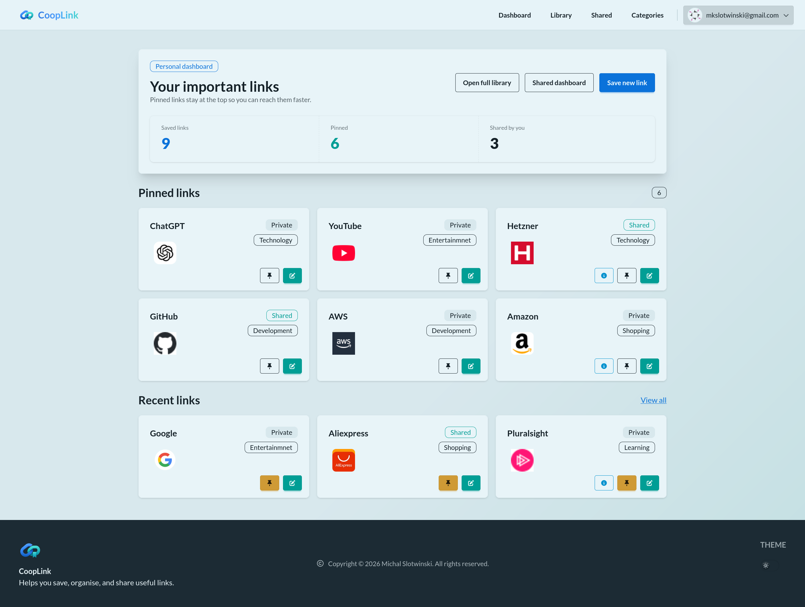

# CoopLink

[](https://www.python.org/)
[](https://www.djangoproject.com/)
[](https://www.postgresql.org/)
[](https://tailwindcss.com/)
[](https://daisyui.com/)
[](https://www.docker.com/)
[](https://kubernetes.io/)

CoopLink is a Django app for collecting, organising, and sharing useful links. Users can keep a private library, pin links for quicker access to a dashboard, and publish selected links to a shared feed for other users.

### Homepage



## Prerequisites

For local development without Docker:

- Python 
- Node.js and npm
- PostgreSQL

For the containerized workflow:

- Docker
- Docker Compose

## Environment Variables

Copy the example file and adjust values as needed:

```bash
cp .env.example .env
```

Important variables:

- `SECRET_KEY`: required, must be a real random secret
- `DEBUG`: `True` for local development, `False` for production
- `ALLOWED_HOSTS`: comma-separated hostnames
- `CSRF_TRUSTED_ORIGINS`: comma-separated full origins such as `https://example.com`
- `DATABASE_URL`: PostgreSQL connection string for local non-Docker runs
- `TEST_DATABASE_URL`: optional separate test database
- `SQLITE_FOR_DEV`: set to `True` to force SQLite for local development commands
- `CLOUDFLARE_TURNSTILE_*` or `TURNSTILE_*`: required Turnstile site and secret keys
- `MAILTRAP_*` or `EMAIL_*`: email backend credentials

Notes:

- In Docker Compose, `DATABASE_URL` is overridden for the `web` container to use the `db` service.
- `.env` is excluded from the Docker build context, so secrets are not baked into the image.

## Local Development

### 1. Access the repository

```bash
cd cooplink
```

### 2. Create and activate a virtual environment

```bash
python -m venv .venv
source .venv/bin/activate
```

### 3. Create the env file

```bash
cp .env.example .env
```

Then edit `.env` and set at least:

- `SECRET_KEY`: required Django secret key. For local development, any long random string is fine. You can generate one with:
  `python -c "import secrets; print(secrets.token_urlsafe(50))"`
- either `DATABASE_URL` or `SQLITE_FOR_DEV=True`
- Turnstile site and secret keys

If you want the local app to ignore `DATABASE_URL` and use SQLite instead, set:

```bash
SQLITE_FOR_DEV=True
```

### 4. Install Python dependencies

```bash
pip install -r requirements.txt
```

### 5. Install frontend dependencies

```bash
cd theme/static_src
npm install
cd ../..
```

### 6. Start PostgreSQL

Skip this step if you are using SQLite for local development.

If you want to run only the database in Docker:

```bash
docker compose up -d db
```

### 7. Apply migrations

```bash
python manage.py migrate
```

### 8. Create a superuser

```bash
python manage.py createsuperuser
```

### 9. Run the app

Terminal 1:

```bash
python manage.py runserver
```

Terminal 2:

```bash
python manage.py tailwind start
```

The app will be available at `http://127.0.0.1:8000`.

If you use `honcho`, the bundled Procfile already forces SQLite for the local Django and Tailwind processes:

```bash
honcho start -f Procfile.tailwind
```

## Docker Compose

Start the full stack:

```bash
docker compose up --build
```

This starts:

- `db`: PostgreSQL 17
- `web`: Django app with migrations applied on startup

Stop the stack:

```bash
docker compose down
```

Remove containers and the database volume:

```bash
docker compose down -v
```

The app will be available at `http://127.0.0.1:8000`.

## Kubernetes / K3s

A sample manifest is included at [`deploy/k8s/cooplink.yaml`](deploy/k8s/cooplink.yaml).

Before applying it:

- replace `your-dockerhub-user/cooplink:latest` with your published image
- replace the placeholder secret values
- set real `TURNSTILE_SITE_KEY` and `TURNSTILE_SECRET_KEY`

Apply the manifest:

```bash
kubectl apply -f deploy/k8s/cooplink.yaml
```

Check the deployment:

```bash
kubectl get pods
kubectl get svc
```

## Project Structure

```text
apps/
  accounts/    Authentication, profile, OTP, password reset
  links/       Link library, dashboards, categories
config/        Django settings and root URLs
theme/         Tailwind and shared templates
compose.yaml   Local container orchestration
Dockerfile     Web image build
```
